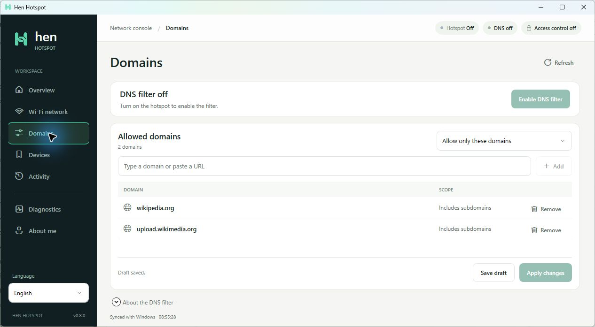
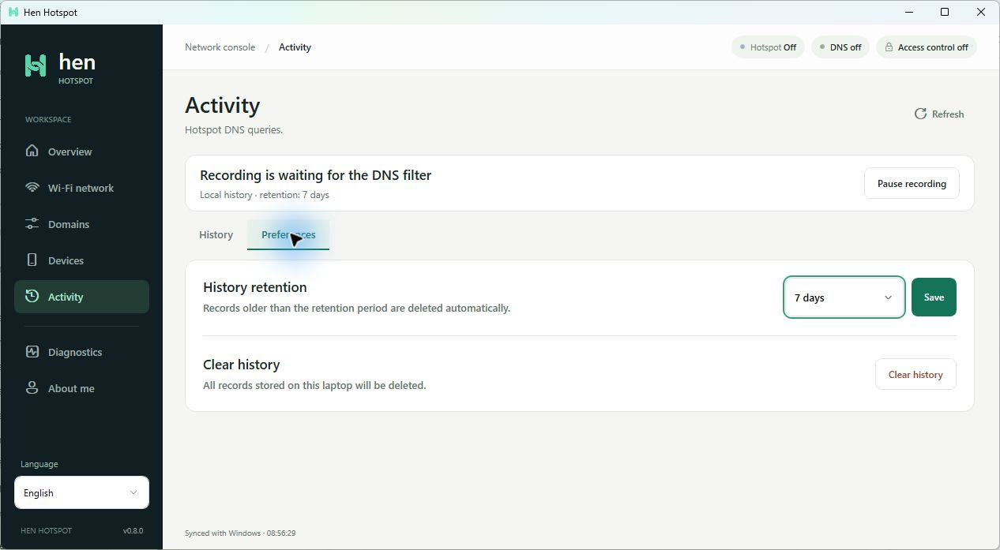
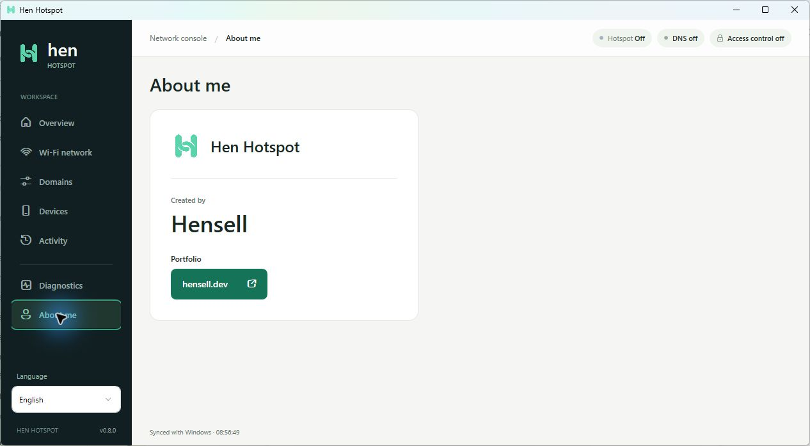

# Hen Hotspot

A native Windows 11 app for sharing a Wi-Fi connection, managing connected devices, and filtering hotspot DNS requests. Built with WPF and .NET 10.

**Version 0.8.0 · Windows 11 x64 · Español / English / Português (Brasil) · [MIT](LICENSE)**

[Download for Windows](https://github.com/Hensell/hen-hotspot/releases/latest) · [Install](#install-on-windows) · [Build and run](#build-and-run) · [Filtering scope](#filtering-scope) · [Performance](#performance) · [Contributing](CONTRIBUTING.md)



Actual application screenshots in English. The filters are off in these captures; the Wikipedia entries illustrate a saved allowlist.

<details>
<summary>More screenshots: activity preferences and About me</summary>





</details>

DNS filtering and device access control are experimental. Review the scope and shutdown behavior below before relying on either control.

## Features

- Turn the Windows mobile hotspot on or off and check its status from any screen.
- Configure the network name, password, and Wi-Fi band while the hotspot is off.
- View connected devices and save device approvals or blocks by MAC address.
- Choose a DNS blocklist or allowlist with up to 128 domains, including subdomains.
- Add a domain or paste a web URL, manage entries as rows, and confirm before deleting.
- Save drafts separately from the rules applied to a running filter.
- Review local DNS activity, filter records, pause recording, and choose a retention period.
- Inspect network adapters and export diagnostics.
- Switch languages from the sidebar without restarting the app or changing active rules.
- Open the creator's portfolio from **About me** in your default browser.

The DNS filter runs on the laptop through WinDivert. Phones do not need a manual proxy configuration.

## Requirements

- Windows 11, x64.
- A wireless adapter and driver that support Windows mobile hotspot.
- An internet connection to share. Receiving and sharing internet over Wi-Fi depends on the adapter and its driver.
- Administrator approval when enabling the DNS filter or device access control. The main interface runs without elevation.
- The .NET 10 SDK to build from source. A self-contained published build includes its runtime.

Windows and the adapter determine the maximum number of connected devices.

## Install on Windows

Download the [Windows 11 x64 installer](https://github.com/Hensell/hen-hotspot/releases/download/v0.8.0/HenHotspot-Setup-0.8.0-win-x64.exe), run `HenHotspot-Setup-0.8.0-win-x64.exe`, and choose an installation folder. Setup supports English, Spanish, and Brazilian Portuguese, adds a Start menu shortcut, and offers an optional desktop shortcut.

The installer includes the app, the .NET 10 desktop runtime, SQLite, WinDivert, and the bundled licenses and WinDivert source archive. Installation works offline; no separate .NET or proxy installation is needed. The build currently targets native x64 Windows 11, not Windows on Arm.

The default location is `%LOCALAPPDATA%\Programs\Hen Hotspot` for the current Windows user. Setup does not start the hotspot or enable filters. Administrator approval is requested by the app when you enable a filtering component.

Close Hen before updating or uninstalling it. Running the next installer updates the existing installation; an older version cannot replace a newer app in the selected folder. Settings and history stay in `%LOCALAPPDATA%\HenHotspot` and are preserved by updates and uninstallation. Uninstall through **Settings → Apps → Installed apps → Hen Hotspot**.

Current builds of Hen and its installer are not code-signed. The bundled WinDivert driver retains its upstream signature. A SHA-256 checksum is generated alongside each installer to verify file integrity.

To create the installer from source, install [Inno Setup](https://jrsoftware.org/isdl.php) 6.7.3 or later, then run:

```powershell
.\installer\Build-Installer.ps1
```

The installer and checksum are written to `dist/`. See [installer development and verification](installer/README.md) for custom compiler paths and release checks. Generating an installer does not publish a GitHub release.

## Build and run

Run these commands on Windows from the repository root:

```powershell
dotnet restore src/HenHotspot.csproj --locked-mode
dotnet build src/HenHotspot.csproj -c Release --no-restore
dotnet run --project src/HenHotspot.csproj -c Release
```

Publish a self-contained Windows x64 build:

```powershell
dotnet publish src/HenHotspot.csproj -c Release -r win-x64 --self-contained true -p:RestoreLockedMode=true -o app
```

Open `app/HenHotspot.exe`. When moving the app to another laptop, copy the **entire published directory**, including `WinDivert.dll`, `WinDivert64.sys`, and `ThirdParty/`. Copying the executable alone is insufficient.

The repository includes the unmodified native WinDivert files and corresponding source archive required by the project. No separate proxy application is needed.

## Using the app

Choose **Español**, **English**, or **Português (Brasil)** from the language selector at the bottom of the sidebar. The selection is saved for the next launch; Spanish is the default. Menus, dialogs, validation messages, and activity labels change immediately. Dates and numbers follow the selected language. Device names, domains, and network names remain as entered. Details supplied directly by Windows may use the system language.

1. Open **Overview** and turn on the hotspot.
2. Connect a phone or another device to the hotspot's Wi-Fi network.
3. In **Domains**, choose **Block domains** or **Allow only these domains**.
4. Enter a domain or paste an HTTP/HTTPS URL, then press Enter or **Add**. A pasted URL contributes its hostname, not its path.
5. Select **Enable DNS filter** and approve the Windows administrator prompt.
6. After editing a running filter's list, select **Apply changes**. **Save draft** saves the list without changing the active policy. Deleting an entry requires confirmation.
7. Review allowed or blocked DNS requests in **Activity**.

Device access control is a separate switch in **Devices**. Saved approvals and blocks take effect only while that control is active. With control enabled, new and blocked devices are denied internet access until approved.

### Example: Wikipedia allowlist

Choose the allowlist mode and add:

```text
wikipedia.org
upload.wikimedia.org
```

The first entry includes Wikipedia's language subdomains. The second allows its image and media host without allowing all of `wikimedia.org`. See the [Wikimedia upload service documentation](https://wikitech.wikimedia.org/wiki/Upload.wikimedia.org).

This is an example configuration, not a profile automatically installed on every laptop.

## Filtering scope

**DNS filtering is not a strict firewall for all browsing or app traffic.** The current implementation intercepts classic IPv4 UDP DNS requests sent to port 53 of the hotspot gateway. Blocked queries receive NXDOMAIN; allowed queries continue to Windows' DNS service.

- External DNS, encrypted/private DNS, VPNs, cached addresses, direct IP connections, and existing connections can bypass these domain rules.
- TCP DNS to the same gateway is blocked while the filter is active because TCP DNS parsing is not implemented. Queries that require this fallback may fail.
- Allowlisted websites may need additional domains for images, sign-in, video, or other resources.
- Rules affect new DNS requests and do not close existing connections.
- The app does not decrypt HTTPS, install certificates on phones, or inspect page content, passwords, or messages.
- This version does **not** limit bandwidth. The earlier proxy-based implementation and its speed controls have been removed.

The filter is scoped to the hotspot interface and gateway DNS. It does not change the laptop's DNS settings or use WinDivert's forwarding layer, which has [documented limitations with Windows NAT](https://reqrypt.org/windivert-doc.html#known_issues).

## Device access and shutdown

Device control associates MAC addresses observed by Windows with their current IPv4 addresses. While enabled, it permits approved device addresses and blocks forwarded IPv6 traffic.

MAC addresses identify network interfaces, not people. This does not prevent password sharing or protect against all MAC/IP spoofing. A device that changes its private MAC address may appear as a new device.

- Turning off the hotspot from Hen stops its filtering components first.
- Closing Hen with device access control enabled turns off the hotspot.
- Closing Hen with only the DNS filter enabled removes that filter; the hotspot may remain on.
- On a filtering failure, Hen attempts to turn off the hotspot. An abrupt termination can leave an interval without its temporary filters.

Keep Hen open while using its filters. Verify the behavior on each laptop and adapter before relying on it.

## Local activity and privacy

DNS activity is a record of queries, **not proof of a website visit**. Background apps can generate queries. DNS records do not measure screen time, browsing duration, or webpage traffic; their duration and traffic columns display a dash. Older connection records retain their original metrics.

Recording can be paused, resumed, or cleared. Retention options are 1, 7, 30, or 90 days. Cleanup retains the 50,000 newest records; an in-flight batch can temporarily exceed that limit. Reducing retention deletes records outside the new period. Under heavy load, the bounded recording queue may omit events even if filter counters increase.

Settings, device permissions, and history are stored locally in `%LOCALAPPDATA%/HenHotspot`. Hen does not upload the history to an external service. Local runtime data is not part of this repository.

## Performance

Hen reduces polling when the hotspot is off or the window is minimized, reacts to Windows network-change notifications, and refreshes when brought back into focus. Active filters and uncertain network states retain two-second safety checks. The administrative helpers keep their independent heartbeats.

History writes run on one background worker, using a prepared SQLite command and transactions of up to 128 queued observations. Pause, clear, and flush commands remain ordered barriers. The Activity view skips automatic database reads when its filters and committed history have not changed, and visual refreshes are skipped while minimized.

An isolated development benchmark of 10,000 history writes used about **89% less process CPU time** after batching and index changes. This is a storage benchmark, not a claim about total CPU usage with connected phones. Hardware, DNS volume, Windows networking, and the selected screen affect overall usage.

Run the repeatable benchmark without changing the hotspot or your history:

```powershell
dotnet run --project tests/HenHotspot.Tests.csproj -c Release -- --benchmark
```

See [methodology and measured results](docs/PERFORMANCE.md) and [architecture and invariants](docs/ARCHITECTURE.md).

## Tests

Run the automated suite on Windows:

```powershell
dotnet restore tests/HenHotspot.Tests.csproj --locked-mode
dotnet build tests/HenHotspot.Tests.csproj -c Release --no-restore -warnaserror
dotnet run --project tests/HenHotspot.Tests.csproj -c Release
```

The tests are an executable verification suite, so use `dotnet run`, not `dotnet test`. By default, they run without elevation, external network calls, or changes to the Windows hotspot. They use temporary databases and packet fixtures.

Optionally include a direct HTTPS connectivity check from the laptop:

```powershell
dotnet run --project tests/HenHotspot.Tests.csproj -c Release -- --internet
```

The suite covers domain/URL validation, storage and recording barriers, profile persistence, device policies, IPC, DNS parsing, 6,000 malformed or mutated packets, native filter compilation, independently verified checksums, localization, and adaptive polling safety. UI validation is performed separately in the installed app.

The [Windows CI workflow](.github/workflows/ci.yml) restores locked dependencies, verifies formatting, builds without warnings, runs the offline suite, and checks self-contained publishing. CI does not enable network filters or replace physical-device testing.

Physical phone tests previously verified a DNS blocklist and the Wikipedia allowlist. A separate device-control test verified an approve → block → approve cycle. Combined operation of DNS filtering and device control still needs physical validation. Automated tests and the laptop's HTTPS check do not replace testing from a connected device.

The optional `--integration` test changes the Windows hotspot configuration and requires the hotspot to be off. Run it only in a controlled test session.

The elevated `--dns-self-test` app option opens a native filter that matches no packets, checks driver version and shutdown behavior, and writes its result to `%LOCALAPPDATA%/HenHotspot/windivert-self-test.json`. It is separate from the automated suite and does not prove that phone traffic is filtered.

## Repository layout

```text
src/                         WPF app, domain policies, and filtering components
src/Assets/Brand/            App icons and brand assets
src/Native/                  WinDivert x64 DLL and signed driver
src/ThirdParty/              Dependency licenses, attribution, and WinDivert source
tests/                       Automated verification suite
docs/                        Architecture, performance notes, and screenshots
installer/                   Windows setup definition and self-contained build script
.github/                     Windows CI and dependency updates
```

Published builds, intermediate files, local shortcuts, and runtime data are excluded from version control.

## Contributing and security

See [CONTRIBUTING.md](CONTRIBUTING.md) for development, testing, localization, and pull-request guidelines. See [SECURITY.md](SECURITY.md) for reporting vulnerabilities and the project's security boundaries. Keep personal network data and browsing history out of issues and screenshots.

## License and third-party components

Original Hen Hotspot code is available under the [MIT license](LICENSE), copyright 2026 Hensell. Included third-party software retains its own license; MIT does not replace WinDivert's terms.

Published builds also include the attribution and license files for .NET, Microsoft.Data.Sqlite, SQLitePCLRaw, and the Windows SDK/C#/WinRT components in `ThirdParty/`. Review the notices when updating dependencies or the bundled runtime.

Hen includes **WinDivert 2.2.2**, an independent project by basil and contributors, not a Microsoft product. The unmodified x64 DLL and signed driver come from the official `WinDivert-2.2.2-A.zip` distribution.

WinDivert is distributed here under LGPL version 3 or later. Its license, attribution, and corresponding source archive are included in [src/ThirdParty/WinDivert](src/ThirdParty/WinDivert). See the [project](https://reqrypt.org/windivert.html), [documentation](https://reqrypt.org/windivert-doc.html), and [source](https://github.com/basil00/WinDivert/tree/v2.2.2).

Created by **[Hensell](https://hensell.dev/)**.
